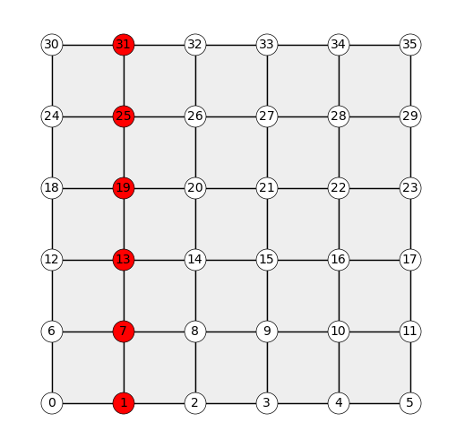

# Assignment

> submitted by Gene Ting-Chun Kao (kao@arch.ethz.ch)

## Geometry

* Given two vectors, use the cross product to create a set of three ortho**normal** vectors.
   - solution file [task1.py](task1.py)
* Use the cross product to compute the area of a convex, 2D polygon.
   - solution file [task2.py](task2.py)
* Define a function for computing the cross products of two arrays of vectors.
   1. The input arrays have the same length (same number of vectors).
   1. Prototype in pure Python (loop over the arrays).
   1. Make Numpy equivalent without loops.
   
   - solution file [task3.py](task3.py)

## Data structures

* Using `faces.obj`
   1. Define a function for traversing the mesh from boundary to boundary in a "straight" line.
   1. Visualise the result.
   
   - solution file [task4.py](task4.py)
   - result visualisation
   
